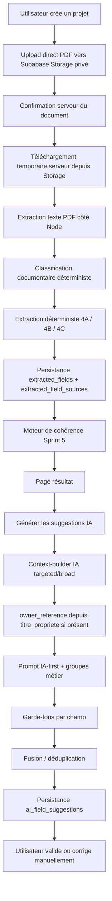

# Pré-État Daté AI — État projet Sprint 9

Dernière mise à jour : 2026-06-24  
Objectif du document : permettre à un nouvel assistant ou développeur de reprendre le projet sans relire l’historique conversationnel.

## Vision produit

Pré-État Daté AI est un MVP destiné à aider un vendeur de lot en copropriété à préparer un pré-état daté à partir des documents qu’il possède déjà : appels de fonds, relevés copropriétaire, PV d’AG, annexes comptables, fiche synthétique, diagnostics, titre de propriété, etc.

Le produit n’est pas un simple prompt IA. La proposition de valeur est un moteur hybride spécialisé copropriété :

- reconnaître les documents ;
- extraire les champs utiles ;
- conserver les sources, pages et extraits ;
- signaler les champs manquants, douteux ou incohérents ;
- proposer des compléments IA traçables ;
- laisser l’utilisateur valider ou corriger ;
- préparer une future génération PDF fiable.

Positionnement : professionnel, rassurant, juridique/immobilier, minimaliste. Le produit ne doit pas faire de promesses juridiques excessives.

## Architecture actuelle

Stack :

- Frontend : Next.js 15, React 19, TypeScript, Tailwind CSS.
- Backend : Next.js App Router + API routes.
- Runtime PDF/IA : Node.js, jamais Edge Runtime.
- Base : Supabase PostgreSQL.
- Stockage : Supabase Storage privé pour PDF sources temporaires.
- Extraction PDF : serveur Node.js avec `pdfjs-dist/legacy`, sans OCR.
- Classification : règles déterministes.
- Extraction déterministe : moteurs simples, financiers, complexes.
- IA : OpenAI optionnel, désactivé par défaut, suggestions séparées dans `ai_field_suggestions`.
- Debug : `/analyse/debug/[projectId]`.
- Page métier : `/analyse/resultat/[projectId]`.

Principes d’architecture :

- les PDF ne sont jamais stockés en base ;
- le texte complet extrait n’est jamais stocké en base ;
- les extraits persistés sont courts, `source_excerpt <= 200` ;
- la clé `SUPABASE_SERVICE_ROLE_KEY` reste serveur uniquement ;
- aucune suggestion IA n’est appliquée automatiquement ;
- les champs manuels/validés sont prioritaires et protégés.

## Pipeline complet



## Schéma base de données

Base Supabase PostgreSQL, RLS activée. Le service role a les droits nécessaires côté serveur.

Tables principales :

### `projects`

Dossier utilisateur anonyme.

Colonnes clés :

- `id`
- `email`
- `status`
- `download_token_hash`
- `download_token_expires_at`
- `paid_at`
- `created_at`
- `updated_at`

Index importants :

- `projects.email`
- `projects.status`

### `documents`

Métadonnées des PDF uploadés. Les PDF eux-mêmes restent dans Supabase Storage.

Colonnes clés :

- `id`
- `project_id`
- `filename`
- `mime_type`
- `size_bytes`
- `storage_path`
- `document_type`
- `document_type_override`
- `is_document_type_manual`
- `classification_status`
- `classification_confidence`
- `classification_version`
- `classification_details`
- `processing_status`
- `auto_delete_after`
- `deleted_at`
- `deleted_reason`
- `error_message`

Types documentaires connus :

- `appel_de_fonds`
- `releve_coproprietaire`
- `pv_ag`
- `annexe_comptable`
- `reglement_copropriete`
- `fiche_synthetique`
- `dtg`
- `ppt`
- `dpe_collectif`
- `titre_propriete`
- `other`

### `reports`

État consolidé du dossier.

Colonnes clés :

- `id`
- `project_id`
- `report_type`
- `completion_rate`
- `confidence_score`
- `status`
- `expires_at`
- `user_validated`
- `user_validation_checkbox_label`
- `final_pdf_generated_at`
- `created_at`
- `updated_at`

Statuts actuels :

- `draft`
- `preview`
- `ready`

### `extracted_fields`

Champs extraits ou corrigés.

Colonnes clés :

- `id`
- `project_id`
- `field_id`
- `label`
- `section`
- `value`
- `normalized_value`
- `confidence`
- `status`
- `extraction_version`
- `manually_edited`
- `field_origin`
- `edited_by_user_at`

Statuts :

- `confirmed`
- `uncertain`
- `missing`
- `inconsistent`

Origines :

- `automatic`
- `manual`
- `validated`

Règle critique : `manually_edited=true`, `field_origin=manual` ou `field_origin=validated` ne doivent jamais être écrasés par extraction, cohérence ou IA.

### `extracted_field_sources`

Sources des champs extraits.

Colonnes clés :

- `id`
- `extracted_field_id`
- `document_id`
- `source_page`
- `source_excerpt`
- `source_locator`
- `matched_rule`
- `confidence`

### `ai_field_suggestions`

Suggestions IA séparées des champs confirmés.

Colonnes clés :

- `id`
- `project_id`
- `field_id`
- `value`
- `normalized_value`
- `confidence`
- `should_apply`
- `source_document_id`
- `source_document_filename`
- `source_page`
- `source_excerpt`
- `reasoning`
- `model`
- `prompt_version`
- `status`
- `suggestion_origin`

Statuts Sprint 9 :

- `proposed`
- `proposed_review`
- `proposed_conflict`
- `rejected`
- `obsolete`

Règle critique : aucune suggestion IA ne modifie `extracted_fields` automatiquement.

### `project_owner_context`

Contexte propriétaire manuel minimal.

Colonnes clés :

- `project_id`
- `owner_name`
- `known_lot_number`
- `created_at`
- `updated_at`

Règle critique : ces données sont purement manuelles et ne doivent jamais être écrasées par extraction ou IA.

## Sprints réalisés

### Sprint 0

Socle Next.js / TypeScript / Tailwind / shadcn/ui / ESLint / Prettier.

### Sprint 1

Modèle de données Supabase PostgreSQL : projets, documents, champs, sources, rapports, paiements préparés mais Stripe non intégré.

### Sprint 2

Upload temporaire de PDF :

- drag & drop ;
- upload multiple ;
- validation MIME ;
- limites configurables ;
- stockage Supabase Storage privé ;
- association à un projet ;
- purge prévue.

### Sprint 3

Classification documentaire déterministe, sans IA.

### Sprint 3.5

Extraction PDF côté serveur Node, métriques diagnostic, correction Safari/PDF.js, distinction PDF image vs erreur technique.

### Sprint 4A

Extraction déterministe des champs simples :

- syndic ;
- adresse immeuble ;
- dates AG ;
- mandat syndic.

### Sprint 4B

Extraction financière déterministe :

- soldes ;
- impayés ;
- avance de trésorerie ;
- budget ;
- trimestre ;
- fonds travaux.

### Sprint 4C

Extraction complexe déterministe :

- travaux ;
- procédures ;
- emprunt collectif ;
- PPT ;
- DTG ;
- DPE collectif.

### Sprint 5

Moteur de cohérence :

- statuts champ ;
- score global ;
- `reports.completion_rate` ;
- `reports.confidence_score` ;
- `reports.status`.

### Sprint 5.1

Page debug + correction manuelle type documentaire.

### Sprint 5.2

Améliorations terrain Foncia, diagnostic candidats, correction `syndic_email`.

### Sprint 5.3

Validation/correction manuelle des champs extraits.

### Sprint 5.4

Diagnostic avancé des champs manquants/douteux/incohérents.

### Sprint 5.5

Tests automatiques sur dossiers réels locaux.

### Sprint 5.6

Rapport de couverture documentaire.

### Sprint 6

Page métier `/analyse/resultat/[projectId]`.

### Sprint 7

Extraction renforcée des PV d’AG longs.

### Sprint 7.1

Contexte propriétaire manuel minimal :

- `owner_name`
- `known_lot_number`

### Sprint 8

Suggestions IA séparées dans `ai_field_suggestions`, désactivées par défaut, sans application automatique.

### Sprint 8.2

Pivot IA-first initial :

- allowlist IA complète ;
- prompt v2 ;
- broad mode ;
- `titre_propriete` ;
- bouton “Générer les suggestions IA” ;
- benchmark IA.

### Sprint 9

IA First Production Ready, état actuel.

## État Sprint 9

Sprint 9 est implémenté dans une version volontairement simple, sans migration supplémentaire.

Livré :

- `titre_propriete` renforcé comme source prioritaire ;
- `owner_reference` calculé depuis titre de propriété ;
- groupes de prompt métier ;
- broad mode enrichi ;
- garde-fous par champ ;
- fusion/déduplication des suggestions IA ;
- benchmark enrichi ;
- affichage “Propriétaire identifié à partir du titre de propriété” ;
- recommandations documentaires enrichies avec impact estimé.

Nouveaux modules Sprint 9 :

- `src/lib/ai/suggestions/owner-reference.ts`
- `src/lib/ai/suggestions/prompt-groups.ts`
- `src/lib/ai/suggestions/field-ai-guardrails.ts`
- `src/lib/ai/suggestions/merge-suggestions.ts`

## Fonctionnalités terminées

- Création de projet anonyme.
- Upload PDF temporaire.
- Stockage Storage privé.
- Extraction texte serveur.
- Classification déterministe.
- Extraction déterministe 4A/4B/4C.
- Cohérence et score global.
- Page debug.
- Override manuel du type documentaire.
- Correction/validation manuelle des champs.
- Page résultat métier.
- Suggestions IA séparées.
- Bouton de génération IA.
- IA désactivable.
- Broad mode IA.
- `titre_propriete`.
- `owner_reference`.
- Garde-fous anti faux positifs IA.
- Fusion/déduplication basique des suggestions IA.
- Benchmark réel local.

## Fonctionnalités en cours ou incomplètes

- Application manuelle des suggestions IA vers `extracted_fields` depuis la page résultat : non implémentée.
- Score estimé après suggestions directement visible dans l’UI : benchmark le calcule, UI pas encore.
- Prompts IA réellement séparés en plusieurs appels : Sprint 9 garde un orchestrateur simple en un seul appel enrichi.
- Fusion multi-sources avancée avec affichage de plusieurs sources par suggestion : partiel.
- `owner_reference` n’est pas persisté dans une table dédiée ; il est calculé dans le contexte IA et répercuté via suggestions/conflits.
- Objectif 75–85 % sur dossier 3 : non atteint dans le scénario local actuellement disponible.

## Benchmark dossier 3 / benchmark actuel

Le benchmark ChatGPT manuel sur dossier 3 a montré une complétude estimative d’environ 63 %, supérieure au déterministe seul.

Benchmark automatisé actuel, dernière exécution locale :

- Date : 2026-06-24.
- Mode : `broad`.
- Modèle : `gpt-4.1-mini`.
- Statut : exécuté.
- Scénario local disponible : `foncia-001`.
- Suggestions IA générées : 13.
- Complétude déterministe : 19 %.
- Complétude estimée après suggestions : 38 %.
- Rejets : 2.
- Conflits : 0.
- Durée : environ 17,8 s.
- Tokens approx. reportés : 1 879.
- Coût estimé : environ 0,0008 USD.

Champs uniquement IA observés :

- `current_balance_amount`
- `current_quarter`
- `lot_number`
- `seller_account_number`
- `seller_address`
- `seller_name`
- `works_fund_seller_share_amount`
- `works_fund_seller_share_date`

Champs encore insuffisamment proposés dans ce scénario :

- `account_statement_date`
- `current_balance_label`
- `works_fund_annual_amount`
- `legal_proceedings_description`
- plusieurs champs diagnostics/travaux selon disponibilité documentaire.

Important : le scénario local `foncia-001` n’est pas forcément le dossier 3 complet mentionné dans le benchmark manuel. Pour mesurer réellement l’objectif Sprint 9, il faut ajouter le dossier 3 complet dans `test-data/real-world/scenarios.json` avec ses PDF non commités.

## Limites connues

- Pas d’OCR : les PDF image restent non exploitables.
- Le texte complet PDF n’est jamais stocké ; le contexte IA dépend donc de la qualité des extraits sélectionnés.
- Broad mode reste borné par les limites de caractères.
- Un seul appel IA global est utilisé ; des appels spécialisés par groupe pourraient améliorer la complétude.
- Les tableaux PDF sont seulement représentés par le texte extrait, sans reconstruction tabulaire.
- `owner_reference` peut manquer si le titre de propriété est mal classifié, absent ou peu textuel.
- Fusion/déduplication actuelle simple : bonne base, mais pas encore un moteur multi-sources sophistiqué.
- Pas encore d’action utilisateur pour appliquer une suggestion IA vers un champ.
- Pas de génération PDF finale.
- Pas de Stripe.

## Backlog priorisé

### P0 — Qualité IA / benchmark

1. Ajouter le dossier réel 3 complet dans `test-data/real-world/scenarios.json`.
2. Augmenter ou ajuster temporairement :
   - `AI_COMPLETION_MAX_PAGES_PER_DOCUMENT`
   - `AI_COMPLETION_MAX_CHARS_PER_DOCUMENT`
   - `AI_COMPLETION_MAX_TOTAL_CHARS`
3. Lancer le benchmark en `AI_COMPLETION_MODE=broad`.
4. Comparer les champs attendus avec le prompt ChatGPT manuel.
5. Ajouter des extraits ciblés pour les champs encore manquants.

### P1 — Prompts spécialisés réels

Passer de l’orchestrateur simple à plusieurs appels IA par groupe :

- identité/propriétaire/lots ;
- syndic ;
- situation financière ;
- charges/budget/fonds travaux ;
- travaux/juridique/diagnostics.

Objectif : meilleur rappel et moins de confusion.

### P1 — Application manuelle des suggestions IA

Ajouter une action utilisateur :

- “Appliquer cette suggestion”
- écrit dans `extracted_fields`
- conserve les sources IA
- relance uniquement la cohérence.

Toujours aucune application automatique.

### P2 — UI score estimé après suggestions

Afficher dans `/analyse/resultat/[projectId]` :

- complétude actuelle ;
- complétude estimée après suggestions IA ;
- champs gagnés par IA ;
- conflits à arbitrer.

### P2 — Fusion multi-sources avancée

Améliorer :

- affichage des sources multiples ;
- fusion des lots/tantièmes ;
- détection de valeurs suspectes ;
- statut `proposed_review` vs `proposed_conflict`.

### P3 — Production future

- PDF final.
- Stripe.
- Livraison sécurisée.
- Expiration et purge.
- Éventuel OCR après arbitrage produit.

## Prochaines étapes recommandées

1. Versionner ce document comme source de reprise Sprint 9.
2. Ajouter le dossier réel 3 complet aux scénarios locaux non commités.
3. Lancer :

```bash
AI_COMPLETION_ENABLED=true AI_COMPLETION_MODE=broad npm run test:ai-benchmark
```

4. Examiner `test-results/ai-benchmark-report.md`.
5. Identifier les champs absents malgré présence documentaire.
6. Renforcer `context-builder.ts` uniquement pour ces champs.
7. Si le rappel plafonne, passer aux appels IA par groupe.

## Variables d’environnement

Variables Supabase :

```env
NEXT_PUBLIC_SUPABASE_URL=http://127.0.0.1:54321
NEXT_PUBLIC_SUPABASE_ANON_KEY=
SUPABASE_SERVICE_ROLE_KEY=
```

Upload :

```env
MAX_PDF_SIZE_MB=10
MAX_PDF_FILES=10
```

Classification / extraction texte :

```env
CLASSIFICATION_MAX_PAGES=50
CLASSIFICATION_MAX_CHARACTERS=200000
```

IA :

```env
AI_COMPLETION_ENABLED=false
OPENAI_API_KEY=
AI_COMPLETION_MODEL=gpt-4.1-mini
AI_COMPLETION_MODE=targeted
AI_COMPLETION_MAX_DOCUMENTS=8
AI_COMPLETION_MAX_PAGES_PER_DOCUMENT=6
AI_COMPLETION_MAX_CHARS_PER_DOCUMENT=12000
AI_COMPLETION_MAX_TOTAL_CHARS=50000
AI_COMPLETION_MIN_APPLY_CONFIDENCE=85
```

Cron :

```env
CRON_SECRET=
```

Notes :

- `AI_COMPLETION_ENABLED=false` ne doit jamais casser l’application.
- `OPENAI_API_KEY` absent ne doit jamais casser l’application.
- `SUPABASE_SERVICE_ROLE_KEY` ne doit jamais être exposée au navigateur.

## Commandes utiles

Installation :

```bash
npm install
cp .env.example .env.local
```

Supabase local :

```bash
npm run db:start
npm run db:status
npm run db:reset
npm run db:types
npm run db:stop
```

Développement :

```bash
npm run dev
```

Qualité :

```bash
npm run test
npm run typecheck
npm run lint
npm run build
npm run format:check
```

Tests réels locaux :

```bash
npm run test:real-world
npm run test:ai-benchmark
```

Benchmark IA broad :

```bash
AI_COMPLETION_ENABLED=true AI_COMPLETION_MODE=broad npm run test:ai-benchmark
```

## Métriques actuelles

Dernière validation complète Sprint 9 :

- `npm run test` : 15 fichiers, 161 tests passés.
- `npm run typecheck` : OK.
- `npm run lint` : OK.
- `npm run build` : OK.
- `npm run test:real-world` : 1/1 scénario OK.
- `npm run test:ai-benchmark` : rapport généré.

Benchmark IA actuel :

- Mode : `broad`.
- Modèle : `gpt-4.1-mini`.
- Suggestions : 13.
- Complétude déterministe : 19 %.
- Complétude estimée après IA : 38 %.
- Rejets : 2.
- Conflits : 0.
- Durée : environ 17,8 s.

## Coût IA observé

Dernier benchmark local :

- Tokens approx. reportés : 1 879.
- Coût estimé : environ 0,0008 USD.

Cette estimation est indicative. Elle est calculée côté script à partir de la taille de contexte/suggestions, pas depuis une facture OpenAI.

## Risques restants

Risques produit :

- faux positifs financiers ;
- confusion montant appelé vs solde ;
- confusion date seule vs trimestre ;
- lots ou tantièmes d’un autre copropriétaire ;
- procédure interprétée juridiquement au lieu d’être factuelle ;
- surconfiance utilisateur dans une suggestion IA.

Risques techniques :

- extraction PDF textuelle imparfaite ;
- tableaux PDF mal linéarisés ;
- contexte broad encore trop réduit pour reproduire exactement ChatGPT manuel ;
- coût et latence si appels IA multipliés ;
- absence d’OCR pour PDF image ;
- état local dépendant des scénarios non commités.

Garde-fous actuels :

- source obligatoire ;
- extrait court ;
- confiance ;
- `should_apply=false` en cas de doute ;
- anti-calcul/anti-déduction ;
- garde-fous par champ ;
- aucune application automatique ;
- corrections manuelles prioritaires.

## Règles à ne pas oublier

- Ne pas stocker le texte complet des PDF.
- Ne pas logger de données personnelles longues.
- Ne pas exposer `OPENAI_API_KEY` ou `SUPABASE_SERVICE_ROLE_KEY`.
- Ne pas modifier `extracted_fields` depuis l’IA sans action utilisateur explicite.
- Ne pas écraser `owner_context`.
- Ne pas intégrer Stripe, PDF final ou OCR sans demande explicite.
