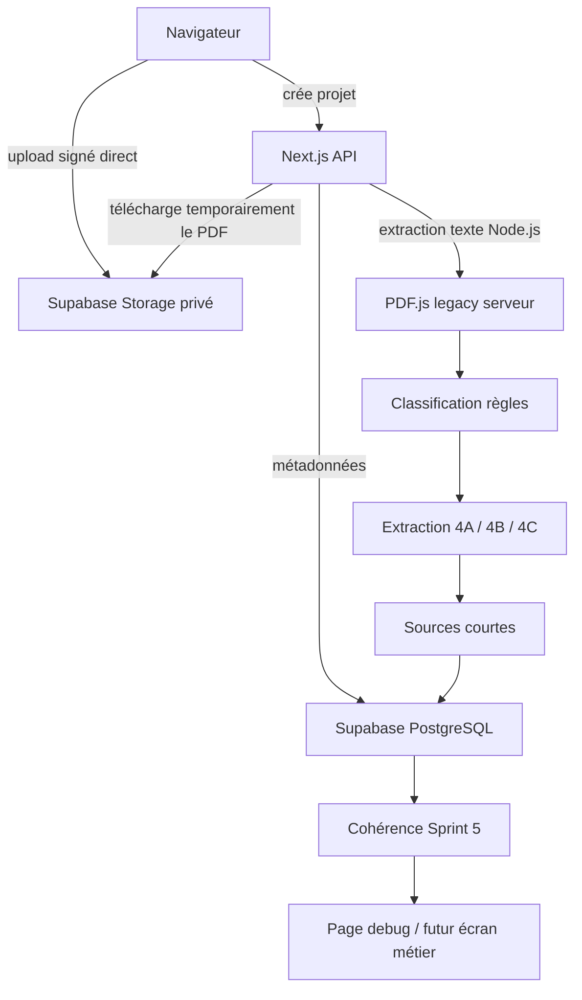
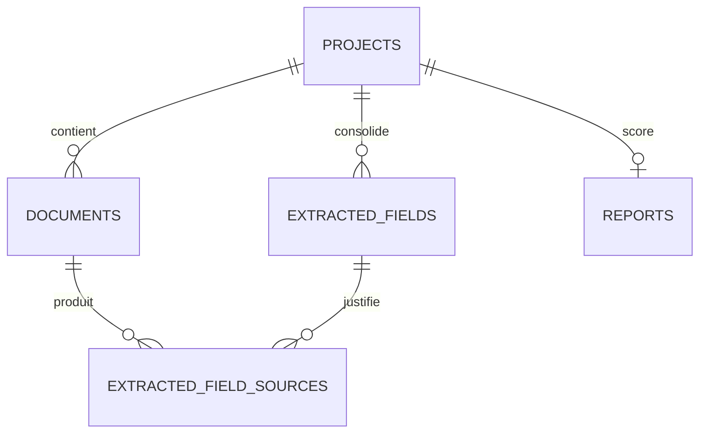

# Architecture technique

Dernière mise à jour : 2026-06-23

## Vue d’ensemble



Les PDF sont stockés temporairement dans Supabase Storage privé. Le texte complet extrait n’est jamais persisté.

## Upload PDF

Le flux d’upload repose sur trois routes :

1. `POST /api/projects` crée un projet et une session anonyme signée.
2. `POST /api/projects/[projectId]/documents/sign` crée la ligne `documents` et génère une URL d’upload signée.
3. `POST /api/projects/[projectId]/documents/confirm` vérifie l’objet dans Storage et déclenche classification/extraction.

Le navigateur envoie le binaire PDF directement à Supabase Storage. Les routes Next.js ne reçoivent pas le fichier pendant l’upload initial.

## Supabase Storage

- Bucket : `source-documents`.
- Visibilité : privé.
- Chemin : `{project_id}/{document_id}/{nom-nettoye}.pdf`.
- Suppression : route `GET /api/cron/purge-documents`.
- Les PDF sources ne sont jamais stockés dans PostgreSQL.

## Extraction texte PDF

L’extraction texte est réalisée côté serveur Node.js dans `src/lib/pdf/extract-text-server.ts`.

Points clés :

- runtime Node.js sur les routes concernées ;
- import dynamique de `pdfjs-dist/legacy/build/pdf.mjs` ;
- `disableWorker: true` côté serveur ;
- limites conservées : `CLASSIFICATION_MAX_PAGES`, `CLASSIFICATION_MAX_CHARACTERS` ;
- métriques conservées dans `classification_details` ;
- aucun OCR.

## Classification

La classification est déterministe et se trouve dans `src/lib/classification/`.

Elle utilise :

- signaux de titre ;
- expressions fortes ;
- mots-clés positifs/négatifs ;
- structures majeures/secondaires ;
- pénalités d’incompatibilité.

Sortie principale :

- `documents.document_type`
- `documents.classification_status`
- `documents.classification_confidence`
- `documents.classification_version`
- `documents.classification_details`

Le type manuel n’écrase pas `document_type`. Le type effectif est :

```ts
document_type_override ?? document_type
```

## Extraction 4A

L’extraction simple est dans `src/lib/extraction/simple/extractor.ts`.

Champs principaux :

- syndic ;
- gestionnaire ;
- coordonnées syndic ;
- adresse immeuble ;
- dates d’AG ;
- dates de mandat syndic.

Les règles sont déterministes. Les candidats sont persistés comme sources courtes, puis fusionnés dans `extracted_fields`.

## Extraction 4B

L’extraction financière est dans `src/lib/extraction/simple/financial-extractor.ts`.

Elle cible :

- solde vendeur ;
- impayés ;
- avance de trésorerie ;
- budget annuel ;
- date de vote du budget ;
- fonds travaux.

Elle supporte les formats français de montants et refuse les extrapolations non explicites.

## Extraction 4C

L’extraction complexe est dans `src/lib/extraction/simple/complex-extractor.ts`.

Elle cible :

- travaux votés et payés ;
- appels travaux futurs ;
- travaux votés non encore appelés ;
- procédures ;
- emprunt collectif ;
- PPT, DTG, DPE collectif.

Le moteur conserve des formulations factuelles et ne produit pas d’interprétation juridique.

## Persistance des extractions



`extracted_fields` contient la valeur canonique. `extracted_field_sources` conserve les sources candidates avec :

- document ;
- page ;
- extrait court ;
- règle déclenchée ;
- score ;
- locator JSON.

Les extraits sont limités à 200 caractères.

## Cohérence Sprint 5

Le moteur se trouve dans `src/lib/consistency/`.

Il :

- crée les champs manquants du catalogue ;
- analyse les valeurs et sources ;
- recalcule les statuts ;
- calcule `completion_rate` et `confidence_score` ;
- met à jour `reports`.

Les champs `manually_edited=true` sont inclus dans les scores mais jamais modifiés.

## Page Debug

Route : `/analyse/debug/[projectId]`.

Elle affiche :

- documents ;
- type automatique et type effectif ;
- métriques PDF ;
- champs extraits ;
- diagnostics avancés de candidats et d’échec par champ ;
- sources ;
- scores du rapport.

Cette page est une interface d’audit et de développement. Elle prépare la future interface métier.

### Diagnostic avancé des champs

Le diagnostic Sprint 5.4 est calculé dans `src/lib/debug/field-diagnostics.ts`.

Il n’écrit aucune donnée et ne modifie ni les extracteurs, ni les seuils, ni les règles métier. Il dérive les informations depuis les documents, champs et sources déjà chargés.

Colonnes exposées :

- `candidate_count`
- `best_candidate_confidence`
- `best_candidate_rule`
- `failure_stage`
- `rejection_reason`

Les étapes possibles de `failure_stage` sont :

- `document_type_gate`
- `label_not_found`
- `amount_not_found`
- `date_not_found`
- `normalization_failed`
- `candidate_below_threshold`
- `merge_rejected`
- `manual_protected`
- `not_implemented`

## Overrides documentaires

Route : `POST /api/projects/[projectId]/documents/[documentId]/type-override`.

Effet :

- renseigne `document_type_override` ;
- met `is_document_type_manual=true` ;
- retraitement limité au document concerné ;
- relance cohérence projet.

Le type automatique reste conservé dans `document_type`.

## Validation manuelle des champs

Routes :

- `POST /api/projects/[projectId]/fields/[fieldId]/update`
- `POST /api/projects/[projectId]/fields/[fieldId]/validate`

Effets :

- `confidence=100` ;
- `status=confirmed` ;
- `manually_edited=true` ;
- `field_origin=manual` ou `validated` ;
- relance uniquement la cohérence Sprint 5.

Les sources existantes ne sont ni modifiées, ni supprimées.

## Tests automatiques de dossiers réels

Le Sprint 5.5 ajoute un runner local :

```bash
npm run test:real-world
```

Le script `scripts/run-real-world-tests.ts` lit `test-data/real-world/scenarios.json`, charge les PDF locaux ignorés par Git dans Supabase Storage local, lance le pipeline existant classification/extraction/cohérence, puis compare les résultats aux attentes du scénario.

Rapports générés :

- `test-results/real-world-report.json`
- `test-results/real-world-report.md`

Le script ne doit jamais afficher le texte complet extrait et ne doit pas être utilisé comme test CI avec des PDF réels commités.

## Couverture documentaire

Le Sprint 5.6 ajoute une lecture de couverture dans la page debug.

Module :

- `src/lib/coverage/document-coverage.ts`

La fonction pure prend les documents et champs déjà chargés depuis PostgreSQL, puis produit une recommandation pour chaque champ `missing` :

- document prioritaire attendu ;
- documents alternatifs possibles ;
- raison courte ;
- statut `document_probably_missing` si le document prioritaire est absent ;
- statut `document_present_rule_missing` si le document prioritaire est déjà présent.

Cette couche ne lit aucun PDF, ne relance aucune extraction et ne modifie aucune donnée.

## Page résultat métier

Le Sprint 6 ajoute la page :

```text
/analyse/resultat/[projectId]
```

Elle charge uniquement les données déjà persistées dans PostgreSQL :

- `reports`
- `documents`
- `extracted_fields`
- `extracted_field_sources`

Le loader `src/lib/result/project-result-data.ts` assemble les sections métier, rattache une source courte à chaque champ et réutilise `buildDocumentCoverageReport`.

La page ne lit pas les PDF, ne relance pas classification, extraction ou cohérence au chargement. Les seules écritures possibles viennent des actions explicites `Modifier` et `Valider`, qui réutilisent les routes Sprint 5.3.
