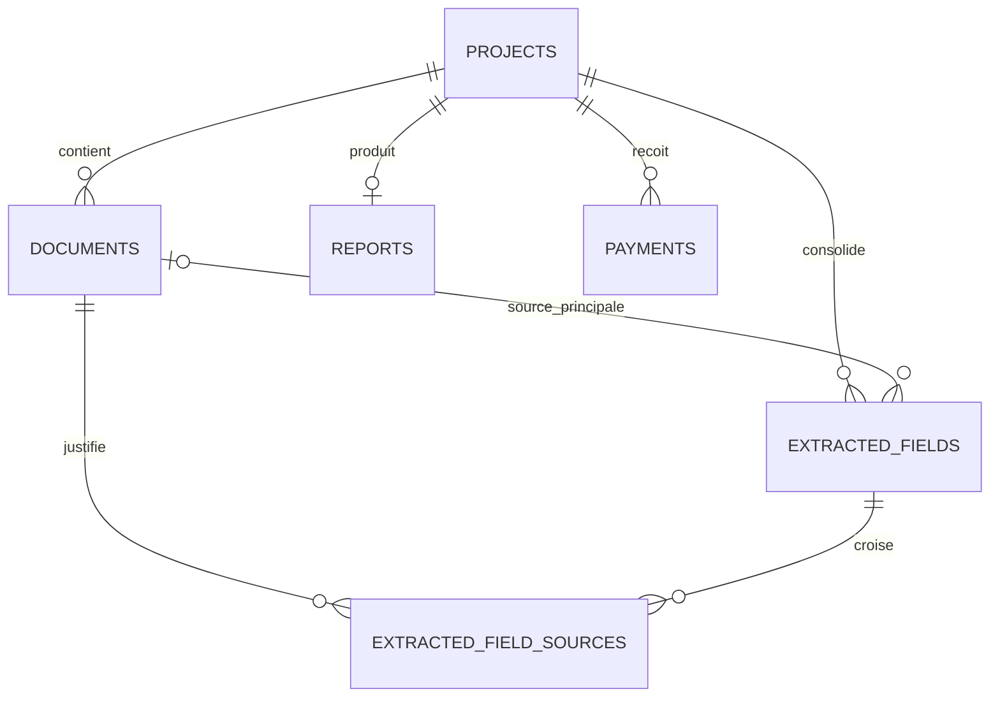

# Schéma de données du MVP

Ce document décrit le modèle PostgreSQL du Sprint 1. La migration SQL située dans `supabase/migrations` reste la source de vérité.

## Relations

## `projects`

Représente un dossier anonyme de pré-état daté. L'email sert à la livraison, sans créer de compte. Les jetons de téléchargement sont stockés sous forme de hash et possèdent une date d'expiration. `paid_at` permettra ultérieurement de mémoriser la confirmation du paiement.

## `documents`

Conserve uniquement les métadonnées des PDF : nom, type détecté, état de traitement et échéance de suppression. Le contenu binaire n'est jamais stocké dans PostgreSQL. `storage_path` est réservé à un stockage objet privé et temporaire lors du Sprint 2.

## `extracted_fields`

Contient la valeur consolidée d'un champ du rapport. `value` accepte une structure JSON, tandis que `normalized_value` fournit une représentation textuelle comparable. Le statut et le score de confiance indiquent si la donnée est confirmée, douteuse, manquante ou incohérente.

## `extracted_field_sources`

Associe un champ à toutes les pièces qui le justifient. La page, un repère structuré et un court extrait peuvent être conservés. Depuis le Sprint 4A, l'extrait est limité à 200 caractères afin de ne pas transformer cette table en stockage du texte OCR complet.

## `reports`

Porte les scores globaux, la validation utilisateur et le cycle de vie du PDF. Le chemin du fichier reste privé ; l'application devra générer un lien signé et temporaire. Un seul rapport est prévu par dossier dans le MVP.

## `payments`

Prépare le stockage des paiements futurs en centimes et en devise ISO. Cette table n'intègre ni SDK Stripe, ni Checkout, ni webhook pendant le Sprint 1. Plusieurs tentatives peuvent appartenir au même dossier, mais un identifiant de session Stripe ne peut apparaître qu'une fois.

## Sécurité et conservation

La Row Level Security est activée sur toutes les tables et aucune politique publique n'est créée. Les accès `anon` et `authenticated` ne peuvent donc lire ou modifier aucune ligne. L'accès serveur sera ajouté dans un sprint ultérieur.

Les suppressions d'un dossier se propagent à ses documents, champs, rapports et paiements. Les dates `auto_delete_after` et `expires_at` sont indexées pour permettre aux futures tâches de purge de retrouver efficacement les données arrivées à expiration.
