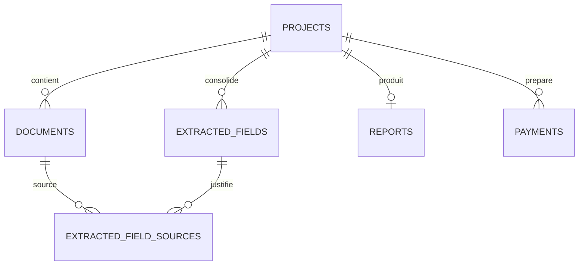

# Modèle de données

Dernière mise à jour : 2026-06-23

La source de vérité technique reste `supabase/migrations/`.

## Relations principales

## `projects`

Dossier de pré-état daté.

Colonnes importantes :

- `id`
- `email`
- `property_address`
- `status`
- `download_token_hash`
- `download_token_expires_at`
- `paid_at`
- `created_at`
- `updated_at`

Index :

- `projects_email_idx`
- `projects_status_idx`

## `documents`

Métadonnées des PDF sources. Le binaire PDF reste dans Supabase Storage.

Colonnes importantes :

- `id`
- `project_id`
- `filename`
- `storage_path`
- `mime_type`
- `size_bytes`
- `document_type`
- `document_type_override`
- `is_document_type_manual`
- `classification_status`
- `classification_confidence`
- `classification_version`
- `classification_details`
- `classified_at`
- `processing_status`
- `error_message`
- `auto_delete_after`
- `deleted_at`
- `deleted_reason`

Règles :

- `document_type` conserve le type automatique.
- `document_type_override` conserve la correction manuelle.
- Le type effectif est `document_type_override ?? document_type`.
- `classification_details` peut contenir des scores, signaux et métriques, jamais le texte complet du PDF.

## `extracted_fields`

Valeur canonique consolidée par champ.

Colonnes importantes :

- `id`
- `project_id`
- `field_id`
- `label`
- `section`
- `value`
- `normalized_value`
- `confidence`
- `status`
- `source_document_id`
- `manually_edited`
- `extraction_version`
- `field_origin`
- `edited_by_user_at`
- `created_at`
- `updated_at`

Contraintes :

- unicité `(project_id, field_id)` ;
- `confidence` entre 0 et 100 ;
- `field_origin` dans `automatic`, `manual`, `validated`.

Règles :

- `manually_edited=true` protège le champ contre les extracteurs et la cohérence.
- `field_origin=manual` signifie correction utilisateur.
- `field_origin=validated` signifie confirmation utilisateur sans modification.

## `extracted_field_sources`

Sources candidates ou justificatives d’un champ.

Colonnes importantes :

- `extracted_field_id`
- `document_id`
- `source_value`
- `confidence`
- `source_locator`
- `source_page`
- `source_excerpt`
- `matched_rule`
- `created_at`

Contraintes :

- clé primaire `(extracted_field_id, document_id)` ;
- `confidence` entre 0 et 100 ;
- `source_page > 0` si renseignée ;
- `source_excerpt <= 200`.

Règles :

- Les sources automatiques ne sont pas supprimées lors d’une correction manuelle.
- `source_excerpt` ne doit jamais contenir de texte complet.

## `reports`

Score et état global du dossier.

Colonnes importantes :

- `id`
- `project_id`
- `report_type`
- `completion_rate`
- `confidence_score`
- `status`
- `pdf_storage_path`
- `is_watermarked`
- `user_validated`
- `user_validation_checkbox_label`
- `validated_at`
- `validation_ip`
- `final_pdf_generated_at`
- `expires_at`
- `created_at`
- `updated_at`

Statuts actuels utilisés par le moteur :

- `draft` si un champ très important est manquant ou incohérent ;
- `preview` si le dossier est exploitable mais contient des incertitudes ;
- `ready` si aucun champ très important n’est manquant/incohérent et si `confidence_score >= 85`.

## `payments`

Table préparatoire pour Stripe. Stripe n’est pas encore intégré dans l’application.

Colonnes importantes :

- `id`
- `project_id`
- `stripe_session_id`
- `amount`
- `currency`
- `status`
- `created_at`
- `updated_at`

Index :

- `payments_stripe_session_id_idx`, unique si non nul.

## Sécurité

- RLS activée sur les tables.
- Aucune politique publique.
- Accès serveur via service role uniquement.
- Grants SQL ajoutés pour permettre au rôle `service_role` d’accéder aux tables publiques sans affaiblir l’accès `anon`.
